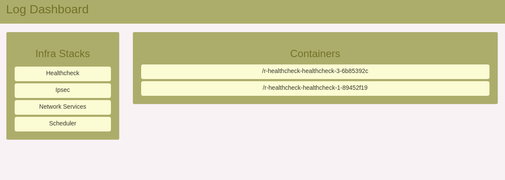

# Rancher Fluentd InfluxDB Stack

This stack consists of four components:

- Fluentd.
- InfluxDB.
- [Logspout-fluentd](https://github.com/galal-hussein/logspout-fluentd).
- [Rancher Log Dashboard](https://github.com/galal-hussein/rancher-log-dashboard).

## Usage

The stack is designed to store historic logs for infrastructure stacks in Rancher environment, First deploy the stack from the UI or using rancher cli:

```
> git clone https://github.com/galal-hussein/rancher-fluentd-Influxdb.git
> cd rancher-fluentd-Influxdb
> rancher up -d --stack infraLogs
```
The stack will depend on the logspout fluentd rancher router that will route logs for Rancher infrastack containers to fluentd.

After deploying the stack navigate to the dashboard on port 5000:


